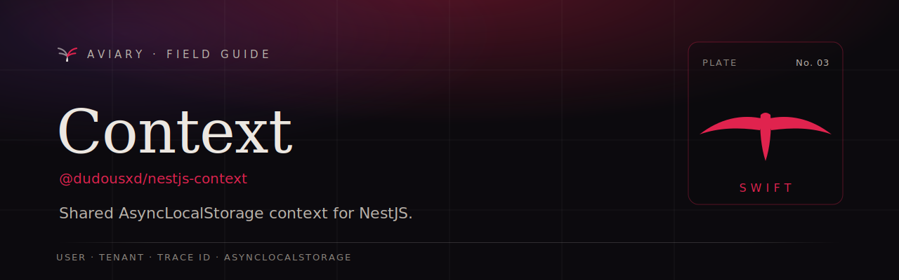

  

  <b><a href="https://davidecarvalho.github.io/aviary/docs/context">📖 Read the documentation</a></b>
  &nbsp;·&nbsp; part of the <a href="https://davidecarvalho.github.io/aviary/"><b>Aviary</b></a> ecosystem for NestJS

---

# @dudousxd/nestjs-context
